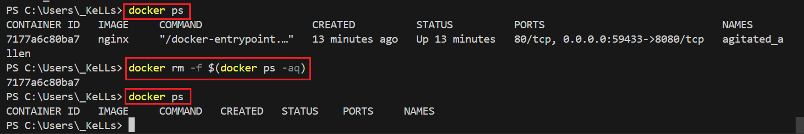
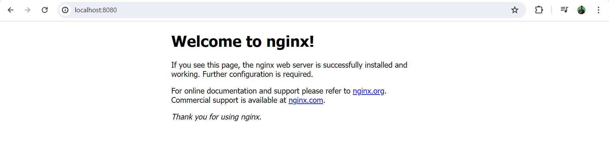
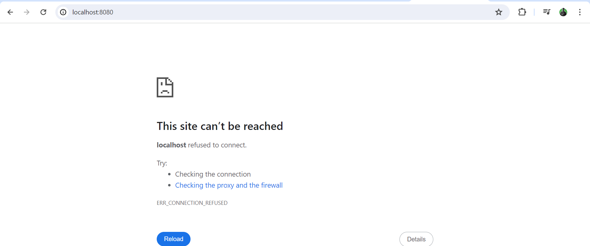
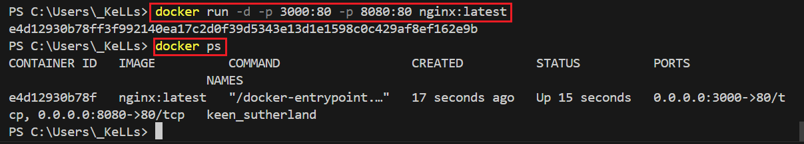
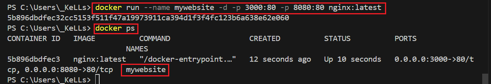
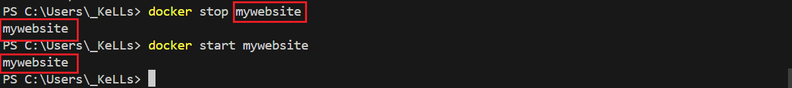
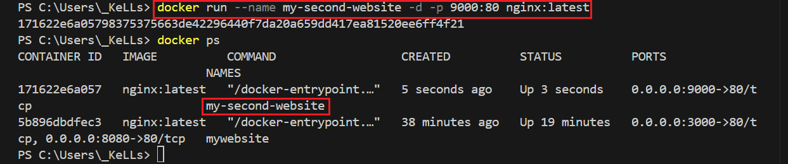
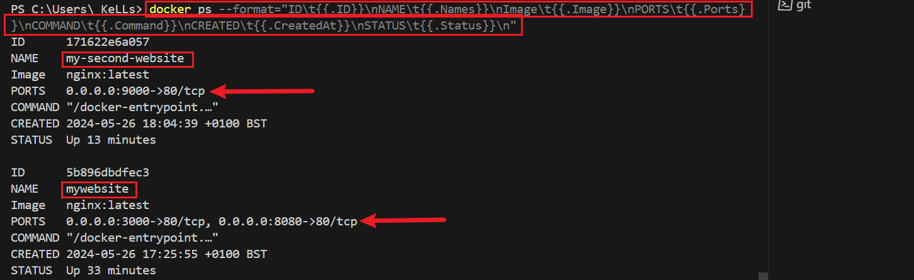
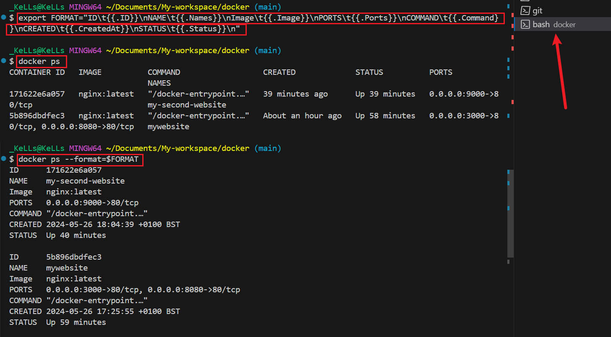
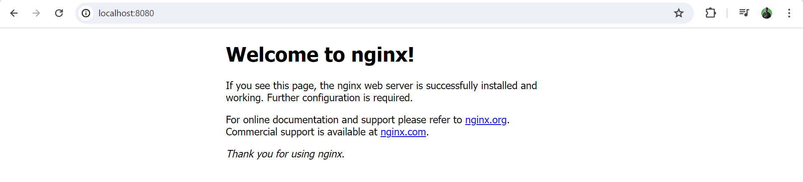

## Managing Containers
___

You cannot remove or delete a running container. But however, you can use this command to force remove a running container. By introducing the -f flag

```
docker rm -f $(docker ps -aq)
```
**`docker ps:`** This command lists all running containers.

**`-aq:** These are flags used with docker ps.

**`-a`** shows all containers (not just running ones), and 

**`-q`** displays only the IDs of the containers.
So, docker ps -aq will list the IDs of all containers, whether they are running or stopped.

**`docker rm:`** This command removes one or more containers.

**`-f:`** This flag forces the removal of a running container. ***(it's generally safer to stop a container before removing it, but -f bypasses that).***





localhost no longer accessible after image has been force-stopped. 



## Naming Containers
___
Let's begin by pulling an image and running a container.

```
docker run -d -p 3000:80 -p 8080:80 nginx:latest
```


When you create a container, a name is randomly given to that contianer. but in reality, you need to give your container a definitive name so you do not need to rely on the container ID or the name that is randomly given when you created the container.

so the way you give your container a name is by using the 

```
docker run --name 
```
command.

```
docker run --name mywebsite -d -p 3000:80 -p 8080:80 nginx:latest
```


It is a best practice reccomendation that you always name your containers because you will most likely be running multiple containers at the same time.




## Docker Ps
___

Sometimes it might be difficut to understand the output of docker ps (PORT, STATUS, CONTAINER ID, IMAGE, etc.) because the lenght might overlap each other which makes it dificult to read. 

let's go ahead and run another container.
```
docker run --name my-second-website -d -p 9000:80 nginx:latest
```


In order to format the above `docker ps` output and make it more readable, we use the line of code below.

```
docker ps --format="ID\t{{.ID}}\nNAME\t{{.Names}}\nImage\t{{.Image}}\nPORTS\t{{.Ports}}\nCOMMAND\t{{.Command}}\nCREATED\t{{.CreatedAt}}\nSTATUS\t{{.Status}}\n"
```

The above `docker ps` output is more readable.

We can now export the `docker ps format` syntax above into a variable (FORMAT), so we can use it anytime in do display a well formated and readable list of running containers.

```
export FORMAT="ID\t{{.ID}}\nNAME\t{{.Names}}\nImage\t{{.Image}}\nPORTS\t{{.Ports}}\nCOMMAND\t{{.Command}}\nCREATED\t{{.CreatedAt}}\nSTATUS\t{{.Status}}\n"
```
```
docker ps --format=$FORMAT
```
This command sets the environment variable FORMAT with the specified format string for formatting Docker container information.

N/: You should run the above command in a bash terminal because `'FORMAT is a bash syntax'`. 
if you are in a windows terminal (powershell), you should use `set` instead of `format` to define environment variable.



## Docker Volumes 
___
Docker volumes allows us to share data. this could be files & folders. You can create a volume through the container and file system.

- Volumes allows us to share data between host and containers.

- Volumes also allows us to share data between containers.

The way it works is that; say you have a container running on a host. so you need to create a volume which allows you to share data between the host and container and vice-versa.

Let's say we add a file in our host machine, this file will also appear in the actual container inside of the volume. Also if you add  a file in the actual volume inside of the container, this will appear in our host operating system. Same  thing applies with folders.

## Sharing Data between Host and Container 
___

Go to 
```
https://hub.docker.com
```
- ***The objective is to understand how we can serve our own files during development, with nginx***

search for nginx

```
docker run --name website -d -p 8080 nginx
```


We'll now have to overite this nginx default webpage by simply mounting a volume from the **`host`** to the **`container`**

## Volumes Between Host and Containers
___


