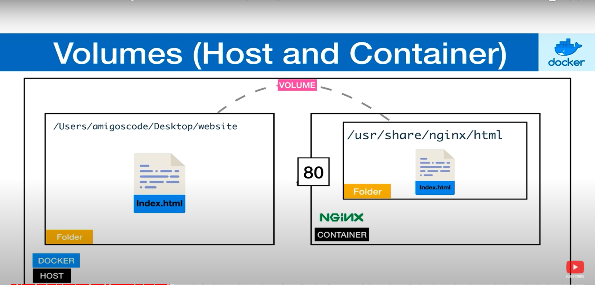
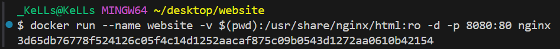

## Managing Containers
___

You cannot remove or delete a running container. But however, you can use this command to force remove a running container. By introducing the -f flag

```
docker rm -f $(docker ps -aq)
```
**`docker ps:`** This command lists all running containers.

**`-aq:** These are flags used with docker ps.

**`-a`** shows all containers (not just running ones), and 

**`-q`** displays only the IDs of the containers.
So, docker ps -aq will list the IDs of all containers, whether they are running or stopped.

**`docker rm:`** This command removes one or more containers.

**`-f:`** This flag forces the removal of a running container. ***(it's generally safer to stop a container before removing it, but -f bypasses that).***


localhost no longer accessible after image has been force-stopped. 


## Naming Containers
___
Let's begin by pulling an image and running a container.

```
docker run -d -p 3000:80 -p 8080:80 nginx:latest
```


When you create a container, a name is randomly given to that contianer. but in reality, you need to give your container a definitive name so you do not need to rely on the container ID or the name that is randomly given when you created the container.

so the way you give your container a name is by using the 

```
docker run --name 
```
command.

```
docker run --name mywebsite -d -p 3000:80 -p 8080:80 nginx:latest
```


It is a best practice reccomendation that you always name your containers because you will most likely be running multiple containers at the same time.


## Docker Ps
___
```
docker ps
```
the above command shows you the list of running containers.

```
docker ps -a
```
the above command shows you the list of stopped containers.

Sometimes it might be difficut to understand the output of docker ps (PORT, STATUS, CONTAINER ID, IMAGE, etc.) because the lenght might overlap each other which makes it dificult to read. 

let's go ahead and run another container.
```
docker run --name my-second-website -d -p 9000:80 nginx:latest
```


In order to format the above `docker ps` output and make it more readable, we use the line of code below.

```
docker ps --format="ID\t{{.ID}}\nNAME\t{{.Names}}\nImage\t{{.Image}}\nPORTS\t{{.Ports}}\nCOMMAND\t{{.Command}}\nCREATED\t{{.CreatedAt}}\nSTATUS\t{{.Status}}\n"
```

The above `docker ps` output is more readable.

We can now export the `docker ps format` syntax above into a variable (FORMAT), so we can use it anytime in do display a well formated and readable list of running containers.

```
export FORMAT="ID\t{{.ID}}\nNAME\t{{.Names}}\nImage\t{{.Image}}\nPORTS\t{{.Ports}}\nCOMMAND\t{{.Command}}\nCREATED\t{{.CreatedAt}}\nSTATUS\t{{.Status}}\n"
```
```
docker ps --format=$FORMAT
```
This command sets the environment variable FORMAT with the specified format string for formatting Docker container information.

N/: You should run the above command in a bash terminal because `'FORMAT is a bash syntax'`. 
if you are in a windows terminal (powershell), you should use `set` instead of `format` to define environment variable.


## Docker Volumes 
___
Docker volumes allows us to share data. this could be files & folders. You can create a volume through the container and file system.

- Volumes allows us to share data between host and containers.

- Volumes also allows us to share data between containers.

The way it works is that; say you have a container running on a host. so you need to create a volume which allows you to share data between the host and container and vice-versa.

Let's say we add a file in our host machine, this file will also appear in the actual container inside of the volume. Also if you add  a file in the actual volume inside of the container, this will appear in our host operating system. Same  thing applies with folders.

## Sharing Data between Host and Container 
___

Go to 
```
https://hub.docker.com
```
- ***The objective is to understand how we can serve our own files during development, with nginx***

search for nginx

```
docker run --name website -d -p 8080 nginx
```


We'll now have to overite this nginx default webpage by simply mounting a volume from the **`host`** to the **`container`**

## Volumes Between Host and Containers
___


Inside our desktop (host machine), we will create a folder called website, and we'll have an index.html file in that website. so that the content of the folder (file) will be shared inside of the container: /usr/share/nginx/html In that way, when we hit our URL in the web browser, we will be served with our own HTML file.

Now we have to start a container and mount our website folder to our container.


```
docker run --name website -v $(pwd):/usr/share/nginx/html:ro -d -p 8080:80 nginx
```
```
-v $(pwd):/usr/share/nginx/html:ro
```
The above command mounts the current directory ($(pwd)) into the container at the path `/usr/share/nginx/html:ro`, with read-only `ro` permissions 

**`The above command is typically used to serve static files from the host machine to the Nginx server running inside the container. So, in summary, this command creates a Docker container named "website" running Nginx, serving files from the current directory on the host machine, and exposes it on port 8080`**.


if we have a file in our container, that will also appear in our host machine.
```
docker exec -it website bash
```
The command above **`docker exec -it website bash`** allows you to execute an interactive shell session within a running Docker container named "website". (getting inside the container shell to view or make some custome changes.)

`docker exec`: This is the command used to execute a command inside a running Docker container.

`-it`: These are flags used together to run the command interactively in the container's terminal. 

`-i`
 stands for interactive, and `-t` allocates a pseudo-TTY (terminal).

`website:` This is the name of the container where you want to execute the command (this can always be changed to the name of the container).

`bash`: This is the command to be executed inside the container. In this case, it's launching the Bash shell, a common command-line interface in Unix-like operating systems.

## Customize Website

Navigate to google and do a search on bootstrap single page template.

click on any of the website template and click on view on github.


After the download is complete, copy everything in the bootstrap folder and paste in the website folder you created earlier.


Go back to the url and refresh the localhost. you should see the updated website content

## Sharing Volumes between Containers


Say we have container `A` and container `B`, we can share a volume between them. We can share the content of a folder or file between these two containers.

The way we can share files and folders between containers is by using a command

```
docker run --help
```
the above command will give you list of commands you can use with docker run.

```
docker run --name website-copy --volumes-from website -d -p 8081:80 nginx
```

`--volumes-from website`: This option mounts volumes from the container named "website" into the new container. This means that any volumes mounted in the "website" container will also be mounted in the "website-copy" container. So, overall, this command creates a new Docker container named "website-copy", using the Nginx image, and mounts volumes from the existing "website" container into it. The Nginx server running inside the "website-copy" container will be accessible on port 8081 of your host machine.
